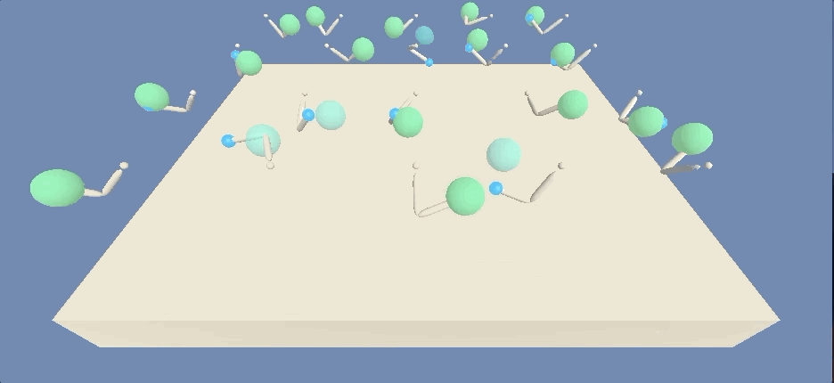

# Reinforcement Learning Project: Continuous Control

 

## Introduction

In this project, we teach an AI reinforcement learning agent in the Unity [Reacher environment](https://github.com/Unity-Technologies/ml-agents/blob/master/docs/Learning-Environment-Examples.md#reacher) to direct a double-jointed robot arm to a target location - marked below by a green bubble - and to maintain contact with the target location for as long as possible. A reward of +0.1 is given for each time step that the agent's hand is in the target location, and the environment is considered solved when the robot arm agent attains an average score of 30+ points over 100 consecutive episodes.

## Environment

Agent was learned on Reacher environment with `20` simultanous agents for faster rollout gathering. Environment is solved when average reward over all agents in last 100 episodes is over `30.0`. 

```
INFO:unityagents:
'Academy' started successfully!
Unity Academy name: Academy
        Number of Brains: 1
        Number of External Brains : 1
        Lesson number : 0
        Reset Parameters :
		goal_speed -> 1.0
		goal_size -> 5.0
Unity brain name: ReacherBrain
        Number of Visual Observations (per agent): 0
        Vector Observation space type: continuous
        Vector Observation space size (per agent): 33
        Number of stacked Vector Observation: 1
        Vector Action space type: continuous
        Vector Action space size (per agent): 4
        Vector Action descriptions: , , , 
```

## Getting started

Make sure you have python 3.6 installed and virtual environment of your choosing activated. Unity has to be installed on your system. Run:

```pip -q install ./python\n```

to install python dependencies. Then you should be able to run jupyter notebook and view `Continous_Control.ipynb`.

## Instructions

Run `Continous_Control.ipynb` for training the model.

Run `python run_trained_agent.py` to run the agent with trained parameters.
