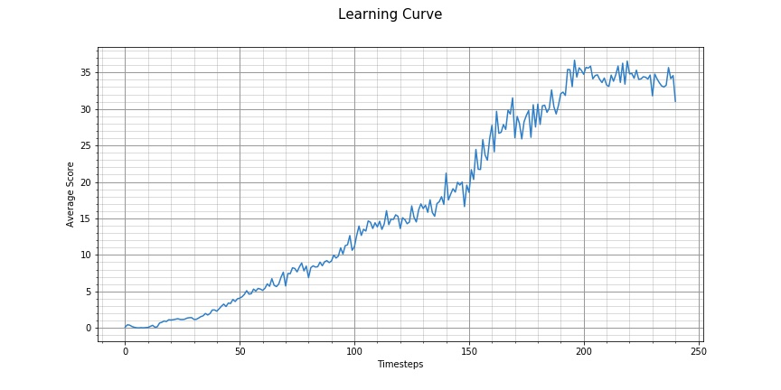
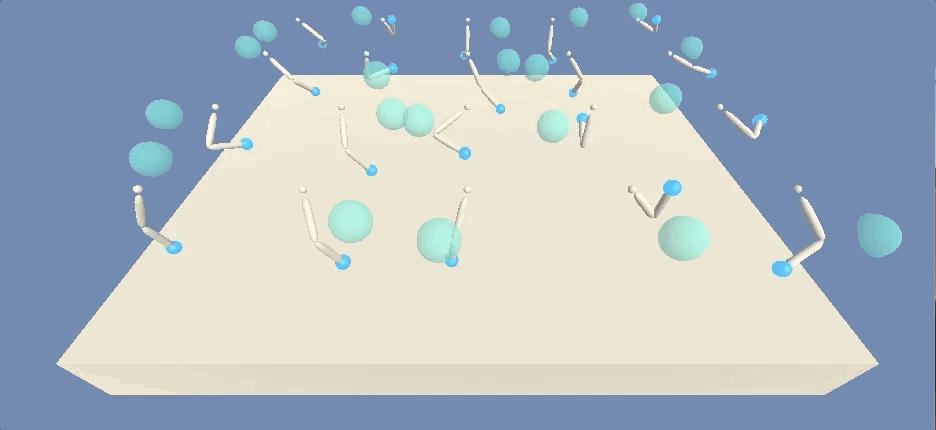
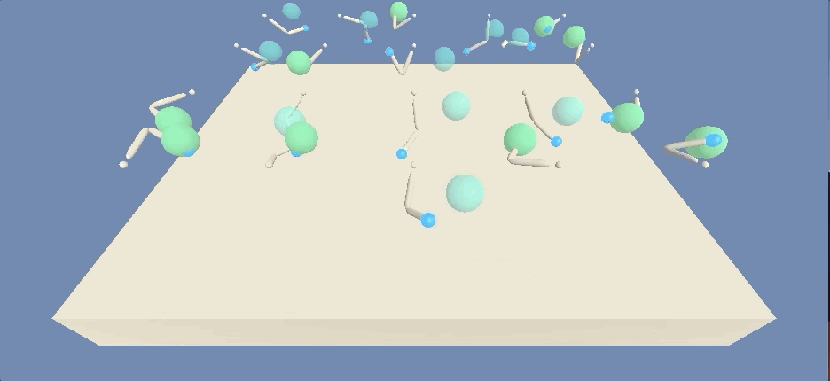

# Project report

## Learning Algorithm

Reinforcement learning algorithms using neural networks as function approximators can take one of two approaches in regards to the thing they are estimating. Firstly, given a state as input they can estimate the expected future rewards for different possible actions. This approach is known as a **value-based method**, and has seen great success and attention in the form of the Q-learning algorithm developed by [Mnih et al (2013)](https://arxiv.org/pdf/1312.5602v1.pdf), which was succesfully trained to play Atari 2600 games with super human performance. With this approach, the policy might be to chose the action that has the highest estimated value. One of the limitations of such an approach, however, is that such an approach only really works when the action space is discrete in nature (e.g. chosing one of a small number of possible actions). This approach is not particularly suiltable when you have an action space that is continuous, where any particular action can have potentially infinite possible values (e.g. accelerating a limb by a certain amount).

For tasks that involve continious actions, there is a second approach that is more suitable. You can use a function approximator to estimate the actual policy directly. For example, the output might be the actual amount that you should accelerate a limb by. This approach is known as a **policy based** method.

Policy based methods have low bias, however tend to suffer from a a variance problem. This is in contrast to value based methods which have low variance. For this reason, a hybrid approach known as **actor-critic** methods were created which combine the benefits of both value based methods and policy based methods. The idea is to use a policy based method to calculate the actions to take (actor), and a seperate value-based network (critic) that calculates the value of the actions, which are used to calculate the loss function of the actor network. The result is an agent that has low variance and low bias.

The specific actor-critc learning algorithm used in this project is the Deep Deterministic Policy Gradient (DDPG) algorithm introduced by [Lillicrap et al (2015)](https://arxiv.org/abs/1509.02971). The implementation is based on the code in [ddpg-bipedal](https://github.com/udacity/deep-reinforcement-learning/tree/master/ddpg-bipedal) code created by Udacity, but modified slightly to handle multiple simultaneous agents in the same environment.


```
The architectures used by the actor and critic network are as follows:

# ACTOR NETWORK
Batch Norm Layer
Fully Connected Layer(input_size=33, output_size=256)
Leaky Relu(leakiness=0.01)
Fully Connected Layer(input_size=256, output_size=128)
Leaky Relu(leakiness=0.01)
Fully Connected Layer(input_size=128, output_size=4)
Tanh Activation()


# CRITIC NETWORK
Batch Norm Layer
Fully Connected Layer(input_size=33, output_size=256)
Leaky Relu(leakiness=0.01)
Fully Connected Layer(input_size=256+33, output_size=128)
Leaky Relu(leakiness=0.01)
Fully Connected Layer(input_size=256, output_size=128)
Leaky Relu(leakiness=0.01)
Fully Connected Layer(input_size=128, output_size=1)
```
## Hyperparameters

```
BUFFER_SIZE = int(1e6)  # replay buffer size
BATCH_SIZE = 1024       # minibatch size
GAMMA = 0.99            # discount factor
TAU = 1e-3              # for soft update of target parameters
LR_ACTOR = 1e-4         # learning rate of the actor
LR_CRITIC = 3e-4        # learning rate of the critic
WEIGHT_DECAY = 0.0001   # L2 weight decay
LEAKINESS = 0.01
```
## Training

Training of the agent was performed on the [`Continous_Control.ipynb`](Continous_Control.ipynb) notebook.

## Results

The agent was able to solve the environment in 141 episodes with an average Score: 30.08. Below is the learning curve.



## Next Steps

- **Try PPO** - To try running this environment using the PPO.
- **Write generic implementation** - to reuse this repository on other problems and with other libraries (like `Gym`).

## Pre-training



## Mid-way training



## Trained


